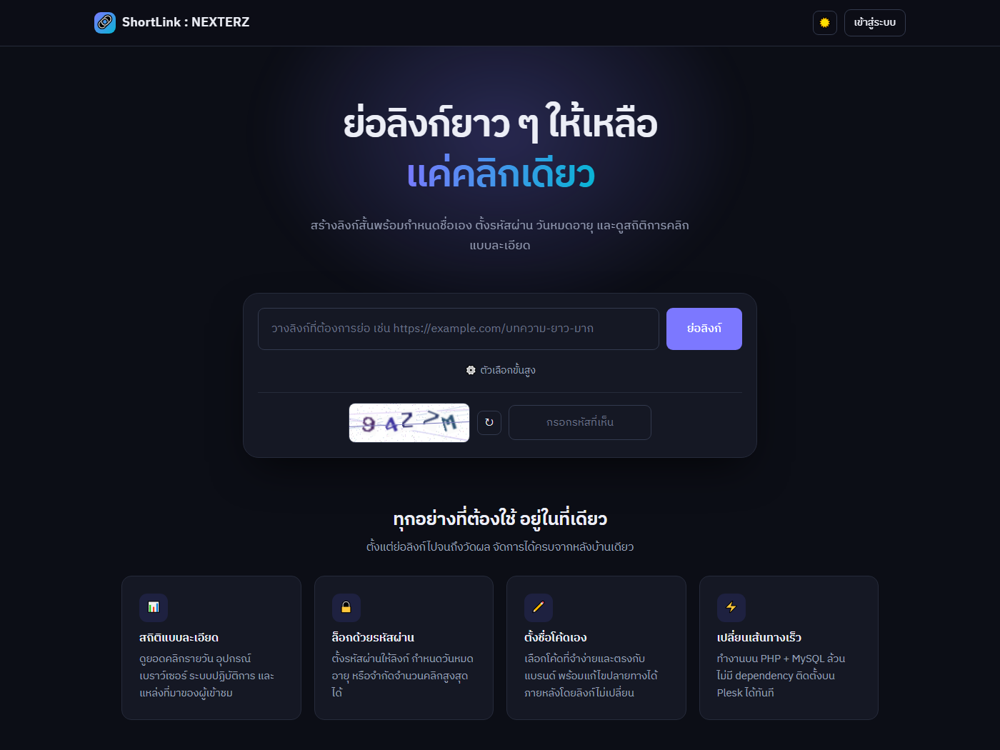
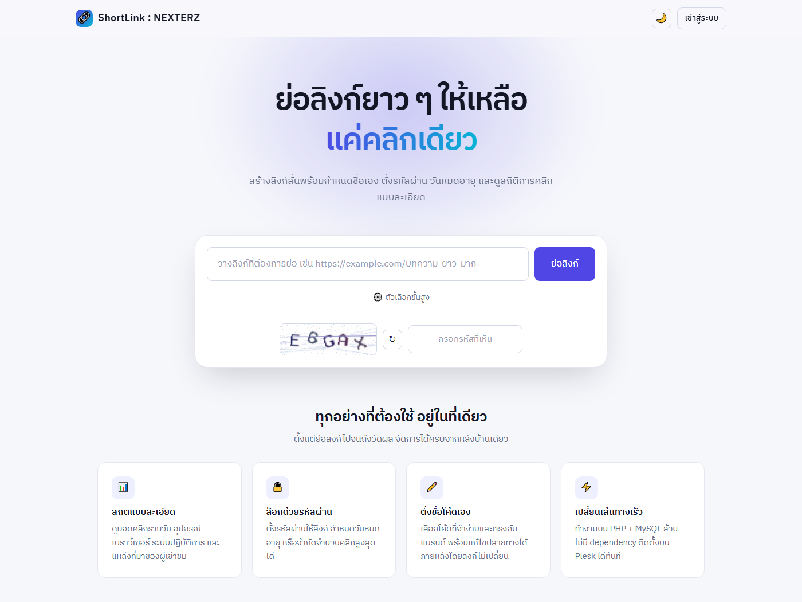
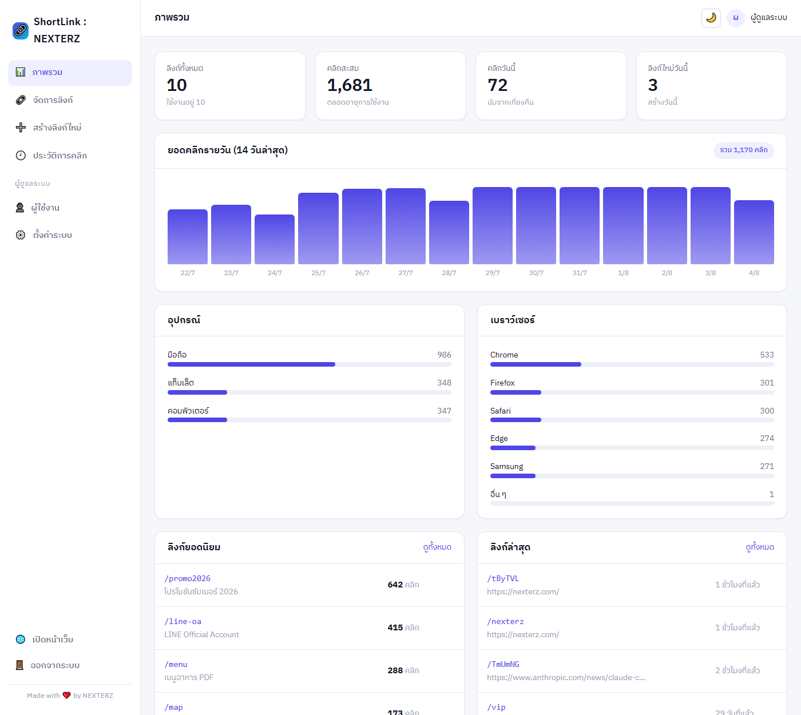
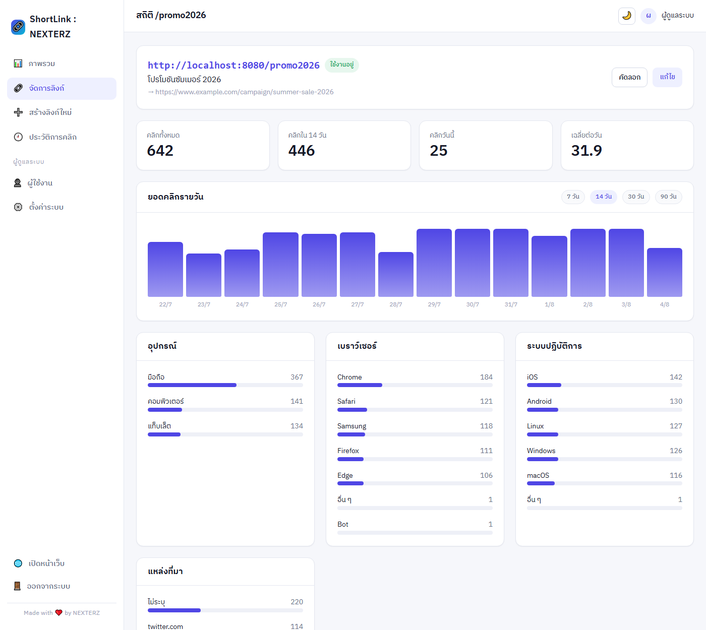
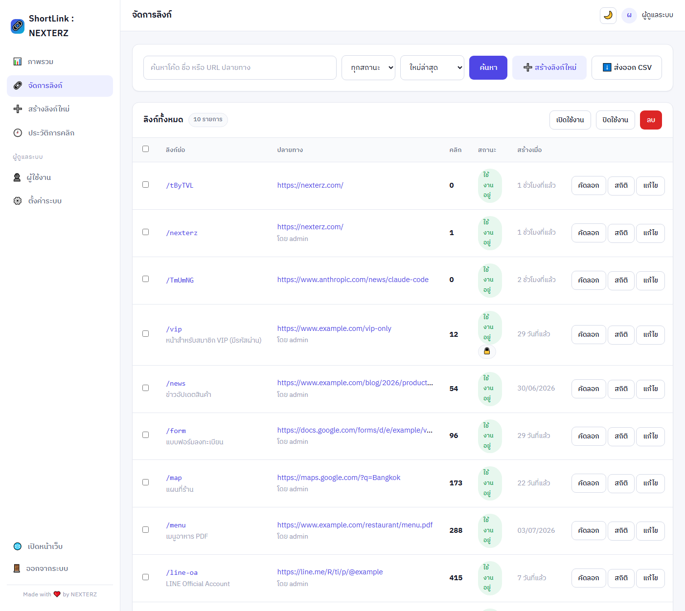
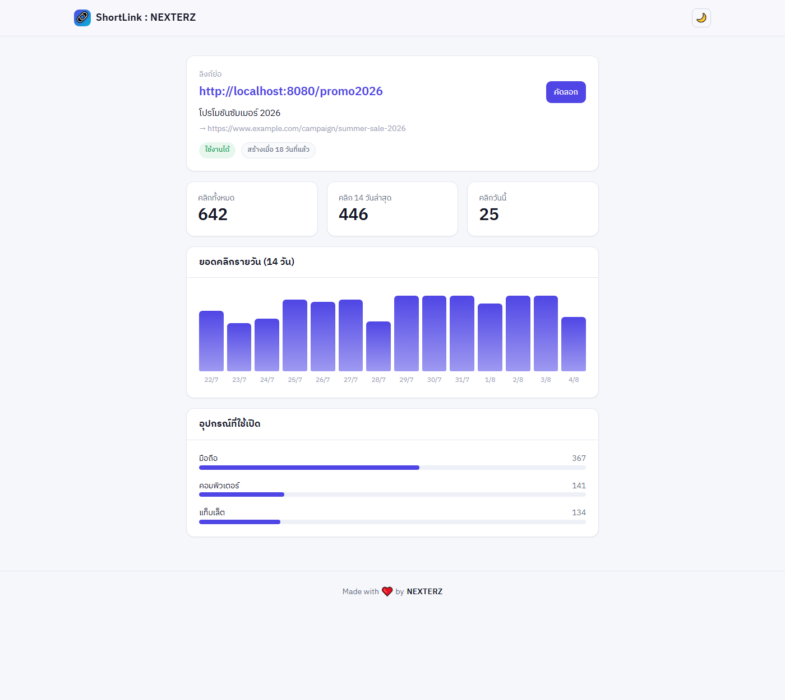
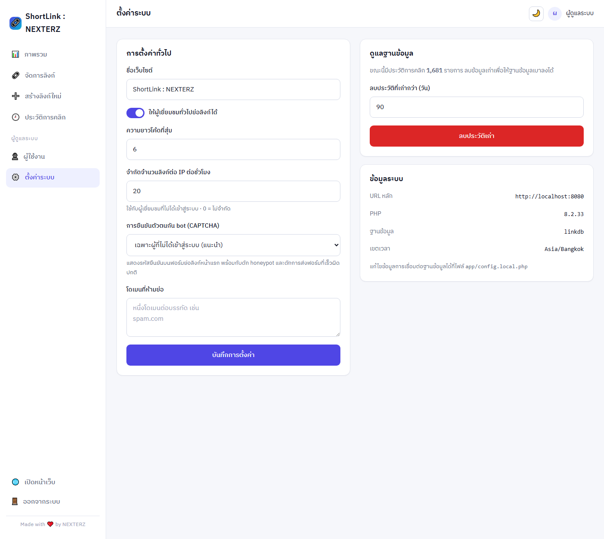

<div align="center">

# 🔗 ShortLink

### ระบบย่อลิงก์ที่สวย เร็ว และวัดผลได้ — สร้างด้วย PHP + MySQL ล้วน

ไม่ต้องใช้ Composer ไม่ต้องใช้ Node อัปโหลดขึ้น Plesk แล้วใช้งานได้ทันที

[](https://www.php.net/)
[](https://www.mysql.com/)
[](#)
[](#-ติดตั้งบน-plesk)

**[🌐 ดูเว็บจริง → link.nexterz.com](https://link.nexterz.com/)**



</div>

---

## ✨ ทำอะไรได้บ้าง

<table>
<tr>
<td width="50%" valign="top">

**สำหรับผู้ใช้ทั่วไป**

- ย่อลิงก์จากหน้าแรกในคลิกเดียว
- ตั้งโค้ดเองให้จำง่าย เช่น `/promo2026`
- ใส่รหัสผ่านให้ลิงก์ กำหนดวันหมดอายุ จำกัดจำนวนคลิก
- หน้าสถิติสาธารณะที่ `/p/{code}`
- โหมดสว่าง/มืด จำค่าที่เลือกไว้

</td>
<td width="50%" valign="top">

**สำหรับผู้ดูแลระบบ**

- แดชบอร์ดกราฟคลิก อุปกรณ์ เบราว์เซอร์ ระบบปฏิบัติการ
- ค้นหา กรอง เรียง เลือกหลายรายการเพื่อเปิด/ปิด/ลบ
- สถิติรายลิงก์ย้อนหลัง 7 / 14 / 30 / 90 วัน
- ส่งออก CSV เปิดใน Excel ภาษาไทยไม่เพี้ยน
- แยกสิทธิ์ผู้ดูแลระบบ / ผู้แก้ไข

</td>
</tr>
</table>

ออกแบบด้วยฟอนต์ **IBM Plex Sans Thai** ทั้งระบบ ข้อความทุกจุดเป็นภาษาไทย

---

## 🖼 หน้าตาของระบบ

<table>
<tr>
<td width="50%"><br><div align="center"><b>หน้าแรก — โหมดมืด</b></div></td>
<td width="50%"><br><div align="center"><b>หน้าแรก — โหมดสว่าง</b></div></td>
</tr>
</table>

<div align="center">

**แดชบอร์ดหลังบ้าน** — ตัวเลขรวม กราฟรายวัน และสัดส่วนผู้เข้าชม



**สถิติรายลิงก์** — เจาะลึกทีละลิงก์ พร้อมแหล่งที่มาของทราฟฟิก



**จัดการลิงก์** — ค้นหา กรอง จัดการทีละหลายรายการ ส่งออก CSV



<table>
<tr>
<td width="50%"><br><div align="center"><b>สถิติสาธารณะ <code>/p/{code}</code></b></div></td>
<td width="50%"><br><div align="center"><b>ตั้งค่าระบบ</b></div></td>
</tr>
</table>

</div>

---

## 🛡 ระบบกัน bot 3 ชั้น

| ชั้น | ทำงานอย่างไร |
|---|---|
| **CAPTCHA รูปภาพ** | วาดเองด้วย GD ไม่พึ่งบริการภายนอก ไม่ต้องใช้ API key · ตัวอักษรเอียงสุ่มมุม มีเส้นและจุดรบกวน · ตัดตัวที่สับสนง่ายออก (0/O, 1/I) · ใช้ได้ครั้งเดียว หมดอายุใน 10 นาที · ถ้าเซิร์ฟเวอร์ไม่มี GD จะเปลี่ยนเป็นโจทย์บวกเลขให้อัตโนมัติ |
| **Honeypot** | ช่องที่ซ่อนจากคนจริงแต่ bot มองเห็นใน HTML ถ้ามีค่าถูกกรอกคือปฏิเสธทันที |
| **ดักเวลา** | ฟอร์มที่ส่งภายใน 2 วินาทีหลังโหลดหน้าถือว่าเป็นสคริปต์ |

เลือกได้จากหลังบ้านว่าจะบังคับ *เฉพาะผู้ที่ไม่ได้เข้าสู่ระบบ* (ค่าเริ่มต้น) / *ทุกคน* / *ปิด*
ใช้ร่วมกับการจำกัดจำนวนลิงก์ต่อ IP ต่อชั่วโมง

---

## 🔒 ความปลอดภัย

- รหัสผ่านเข้ารหัสด้วย `password_hash()` — ไม่มีการเก็บรหัสผ่านแบบอ่านได้
- ทุกคำสั่งฐานข้อมูลใช้ **prepared statement**
- ทุกฟอร์ม POST มีโทเคน **CSRF**
- จำกัดการเข้าสู่ระบบผิดต่อ IP ผ่านฐานข้อมูล (ล้างคุกกี้แล้วเลี่ยงไม่ได้) และเทียบ hash หลอกเพื่อไม่ให้เดาได้ว่ามีชื่อผู้ใช้นั้นจริง
- ลิงก์ที่ล็อกรหัสผ่าน: จำกัดจำนวนครั้งที่เดา และ**ไม่เปิดเผยปลายทาง**ในหน้าสถิติสาธารณะ
- รับเฉพาะปลายทาง `http` / `https` — ยัด `javascript:` ไม่ได้
- คุกกี้เซสชันแบบ HttpOnly + SameSite และเปลี่ยน session id ทุกครั้งที่ล็อกอิน
- ปิดการแสดง error บนหน้าเว็บ (บันทึกลง log ของโฮสต์แทน)
- โค้ดฝั่งระบบอยู่นอก document root และมี `.htaccess` ปิดกั้นซ้ำอีกชั้น
- `app/config.local.php` ที่เก็บรหัสผ่านฐานข้อมูลถูกกันไว้ใน `.gitignore` แล้ว

---

## 🚀 ติดตั้งบน Plesk

<details open>
<summary><b>วิธีที่ 1 — ดึงจาก GitHub (แนะนำ อัปเดตง่ายภายหลัง)</b></summary>

1. **สร้างฐานข้อมูล** — Plesk → Databases → Add Database จดชื่อฐานข้อมูล ผู้ใช้ และรหัสผ่านไว้
2. **เชื่อม repo** — Plesk → โดเมน → **Git** → Add Repository → Remote Git repository
   URL: `https://github.com/nexterz-th/ShortLink.git` · Branch: `main`
3. **ตั้ง Document root** — Hosting Settings → ชี้ไปที่โฟลเดอร์ `public`
4. **ตั้ง PHP** — PHP Settings → PHP 8.0 ขึ้นไป และเปิดส่วนขยาย `pdo_mysql` กับ `gd`
5. **เปิดเว็บ** — ระบบจะพาไปหน้า `/install.php` เอง กรอกข้อมูลฐานข้อมูลและบัญชีผู้ดูแลระบบ
6. **ลบไฟล์ติดตั้ง** — ลบ `public/install.php` ทิ้งเพื่อความปลอดภัย
7. **เปิด SSL** — ติดตั้ง Let's Encrypt แล้วยกเลิกคอมเมนต์บล็อกบังคับ HTTPS ใน `public/.htaccess`

การกด Pull ครั้งต่อ ๆ ไปจะไม่ทับ `app/config.local.php` จึงอัปเดตโค้ดได้โดยไม่ต้องตั้งค่าใหม่

</details>

<details>
<summary><b>วิธีที่ 2 — อัปโหลดไฟล์เอง</b></summary>

อัปโหลดทั้งโฟลเดอร์ขึ้น `/httpdocs/` แล้วทำตามข้อ 3–7 ด้านบน

หากเปลี่ยน document root ไม่ได้ ให้อัปโหลดไว้ที่รากตามปกติ — ไฟล์ `.htaccess` ที่รากจะส่งทราฟฟิก
เข้า `public/` และปิดกั้น `app/` ให้เองอัตโนมัติ

</details>

<details>
<summary><b>ลองบนเครื่องตัวเองด้วย Docker</b></summary>

```bash
docker compose up -d
```

เปิด http://localhost:8080 แล้วทำตามหน้าติดตั้ง โดยใช้ค่าเชื่อมต่อฐานข้อมูล:
โฮสต์ `db` · ฐานข้อมูล `linkdb` · ผู้ใช้ `linkuser` · รหัสผ่าน `linkpass`

ปิดเมื่อเลิกใช้: `docker compose down -v`

</details>

---

## 📁 โครงสร้างโปรเจกต์

```
ShortLink/
├── app/                    โค้ดหลัก — ห้ามเข้าถึงจากเว็บ
│   ├── auth.php            ล็อกอิน สิทธิ์ผู้ใช้ และการจำกัดการเดารหัสผ่าน
│   ├── bootstrap.php       จุดเริ่มต้นของทุกหน้า
│   ├── captcha.php         CAPTCHA + honeypot + ดักเวลา
│   ├── config.php          โหลดคอนฟิก
│   ├── config.local.php    คอนฟิกจริง (สร้างตอนติดตั้ง · ไม่ขึ้น git)
│   ├── db.php              เชื่อมต่อฐานข้อมูลและสคีมา
│   ├── helpers.php         ฟังก์ชันช่วยเหลือและการตรวจสอบข้อมูล
│   ├── layout.php          โครง HTML ที่ใช้ร่วมกัน
│   └── links.php           ตรรกะของลิงก์และสถิติ
└── public/                 document root
    ├── index.php           หน้าแรก
    ├── go.php              เปลี่ยนเส้นทาง /{code}
    ├── preview.php         สถิติสาธารณะ /p/{code}
    ├── captcha.php         รูป CAPTCHA
    ├── install.php         ตัวติดตั้ง (ลบทิ้งหลังติดตั้ง)
    ├── admin/              หลังบ้านทั้งหมด
    └── assets/             CSS + JS
```

## 🗄 ตารางในฐานข้อมูล

| ตาราง | หน้าที่ |
|---|---|
| `users` | บัญชีผู้ใช้หลังบ้าน (admin / editor) |
| `links` | ลิงก์ย่อ ปลายทาง รหัสผ่าน วันหมดอายุ ยอดคลิก |
| `clicks` | ประวัติการคลิกรายครั้ง (อุปกรณ์ เบราว์เซอร์ OS แหล่งที่มา IP) |
| `login_attempts` | บันทึกการเข้าสู่ระบบที่ล้มเหลว เพื่อจำกัดการเดารหัสผ่าน |
| `settings` | ค่าตั้งค่าระบบแบบ key–value |

## ⚙️ ความต้องการของระบบ

- PHP **8.0** ขึ้นไป · ส่วนขยาย `pdo_mysql` (จำเป็น) และ `gd` (สำหรับ CAPTCHA รูปภาพ)
- MySQL **5.7** / MariaDB **10.3** ขึ้นไป
- Apache พร้อม `mod_rewrite` (ค่าเริ่มต้นของ Plesk เปิดอยู่แล้ว)

## 📝 คำสงวน

โค้ดลิงก์เหล่านี้ใช้ไม่ได้เพราะชนกับเส้นทางจริงของระบบ:
`admin` `api` `assets` `install` `index` `go` `unlock` `p` `preview` `captcha` `login` `logout` `export`

---

<div align="center">

Made with ❤️ by **NEXTERZ**

</div>
